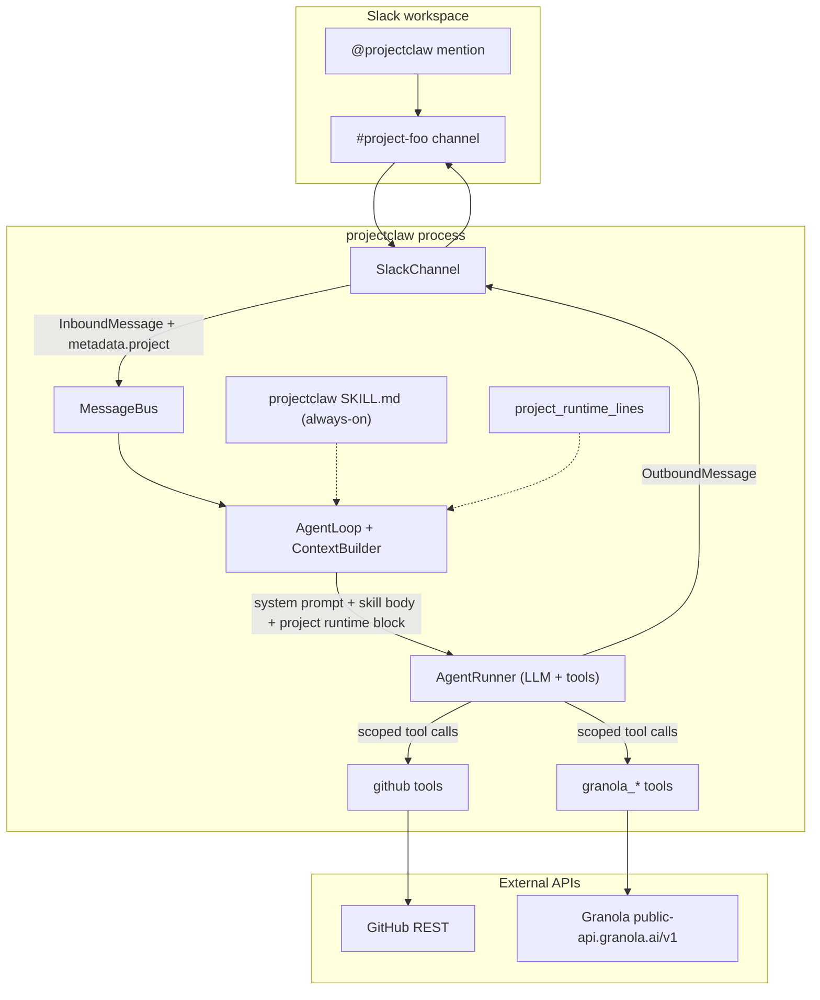

# projectclaw

A multi-project Slack assistant. Answers a team's questions about its projects — status, decisions, action items, code — using **GitHub** and **Granola** (meeting notes) as live sources of truth, scoped per Slack channel.

The premise is simple: each Slack channel maps to one project. When someone asks the bot a question in `#project-foo`, the agent restricts every tool call to that project's GitHub repos and Granola folder. No cross-project leakage; no guessing.

---

## What it does

You DM or `@`-mention the bot in a project channel:

| Question | What the bot does |
|---|---|
| *"what shipped this week?"* | Calls `github_list_pulls` and `granola_list_notes` scoped to the project; combines + cites |
| *"summarize the latest meeting"* | Looks up the latest Granola note in the project's folder; fetches transcript; replies with summary + attendees |
| *"what did we decide about X?"* | Searches recent Granola transcripts in the project's folder + closed PR descriptions |
| *"who owns the auth refactor?"* | Cross-references Granola action items with GitHub assignees |

Answers cite their sources (PR #, issue #, meeting title + date). On tool failure the bot returns a partial answer and surfaces the failure inline — it never silently fabricates.

If you ask in a channel that isn't mapped to a project, the bot refuses to guess: it asks you to specify which project.

---

## Architecture



**Four load-bearing pieces, all at the edges of the runtime:**

1. **`SlackChannel.project_map`** in `nanobot/channels/slack.py` — maps Slack channel ID → `Project` (name, GitHub repos, Granola folder).
2. **`project_runtime_lines`** in `nanobot/agent/context.py` — surfaces the resolved project to the LLM as a `[Runtime Context]` block. Without this, the skill's rules would reference a field the model can't see.
3. **The `projectclaw` skill** at `nanobot/skills/projectclaw/SKILL.md` — text-only policy (always-on) that tells the agent how to read the project scope, which tool family to use per question type, and the *Forbidden* rule: never call a tool with a repo or folder_id outside scope.
4. **The Granola tool** at `nanobot/agent/tools/granola.py` — three read-only tools (`granola_list_notes`, `granola_get_note`, `granola_list_folders`) wrapping `https://public-api.granola.ai/v1` with structured-error semantics (HTTP failures surface inline, never raise).

GitHub access goes through the built-in `github` skill (`gh` CLI under the hood).

---

## Setup

### 1. Slack app

```bash
# Optional CLI (mostly useful for next-generation Slack platform workspaces)
curl -fsSL https://downloads.slack-edge.com/slack-cli/install.sh | bash
```

Either way, the canonical path is:

1. Open [api.slack.com/apps](https://api.slack.com/apps) → **Create New App** → **From a manifest**
2. Pick your workspace → paste `slack-app/manifest.yaml` from this repo → **Create**
3. **Install to Workspace** → copy the **Bot User OAuth Token** (`xoxb-…`) from *OAuth & Permissions*
4. *Basic Information* → **App-Level Tokens** → generate one with `connections:write` scope → copy `xapp-…`
5. Invite `@projectclaw` (or whatever you named the bot) to each project channel: `/invite @projectclaw`

The manifest enables Socket Mode and requests only the scopes the `SlackChannel` actually uses — no over-permissioning.

### 2. Granola API key

Granola desktop → **Settings → Connectors → API keys → Create new key** (Business+ plan; Enterprise admins control which scopes are available). Copy the `grn_…` token. You only see it once.

### 3. OpenAI key (or any other supported provider)

Standard `sk-…` token from [platform.openai.com/api-keys](https://platform.openai.com/api-keys).

### 4. Config

Write to `~/.projectclaw/config.json` (chmod 600):

```jsonc
{
  "agents": { "defaults": { "model": "gpt-4o" } },

  "providers": {
    "openai": { "apiKey": "sk-..." }
  },

  "tools": {
    "granola": {
      "apiKey": "grn_..."
      // base_url and timeout have sensible defaults
    }
  },

  "channels": {
    "slack": {
      "enabled": true,
      "mode": "socket",
      "botToken": "xoxb-...",
      "appToken": "xapp-...",
      "allowFrom": ["*"],
      "replyInThread": true,

      "projectMap": {
        "C0123ABCDE": {
          "name": "foo",
          "github": { "repos": ["acme/foo-api", "acme/foo-web"] },
          "granola": { "folderId": "fol_XYZ123" }
        },
        "C0456FGHIJ": {
          "name": "bar",
          "github": { "repos": ["acme/bar"] }
          // granola omitted — that's allowed; bar isn't tracked in meetings
        }
      },
      "defaultProject": null
    }
  }
}
```

`projectMap` keys must be Slack channel IDs (start with `C`/`D`/`G`/`U`/`W`), not channel names — names get renamed, IDs don't. To find a channel ID: right-click the channel in Slack → *Copy link* → grab the trailing segment.

A project must declare at least one of `github` or `granola`. To find a Granola `folderId`, hit `GET /v1/folders` with your token (or run the bot and ask it: `@projectclaw list our granola folders`).

### 5. Schedule the standup (optional)

The bot can post two recurring updates to your project channel:

- **Daily standup** — Tue–Fri 9am — open PRs awaiting review + PRs merged in the last 24h.
- **Weekly summary** — Mon 9am — all PRs merged in the last 7 days, open PRs aging (oldest first), issues opened/closed in the last 7 days.

Install both with one command:

```bash
python slack-app/install_cron.py
```

The script is idempotent — re-running detects existing jobs by name and skips them. Both jobs target `#gies-disruption-lab` (channel ID `C0B6FAWLRA7`) via the channel routing in `~/.projectclaw/workspace/cron/jobs.json`. Edit `slack-app/install_cron.py` if you want a different channel or schedule.

The cron only fires while `projectclaw gateway` is running — if the host is asleep at 9am, that standup is silently missed (no catch-up).

### 6. Run it

```bash
projectclaw gateway
```

Watch for `Slack Socket Mode WebSocket connected (events enabled)` in the log. Then in a mapped channel:

> @projectclaw summarize the latest meeting

…and the agent should reply with a cited summary from the right Granola folder. Or for a GitHub-side test:

> @projectclaw what's open right now?

…which exercises the always-on `github` skill (`gh` CLI required on the host, authenticated via `gh auth login`).

---

## Configuration reference

### Per-channel `Project` (under `channels.slack.projectMap`)

| Field | Type | Required | Notes |
|---|---|---|---|
| `name` | string | yes | Short, used in replies and as `defaultProject` reference |
| `github.repos` | string[] | one of github/granola | `owner/repo` form; non-empty list |
| `granola.folderId` | string | one of github/granola | Granola folder ID (e.g. `fol_…`) |

### `tools.granola`

| Field | Default | Notes |
|---|---|---|
| `enable` | `true` | If `false`, all 3 granola tools become unavailable to the agent |
| `apiKey` | `""` | If empty, the tools refuse rather than hit the API |
| `baseUrl` | `https://public-api.granola.ai/v1` | Override only if Granola changes their endpoint |
| `timeout` | `30` (seconds) | Per-request httpx timeout |

### `channels.slack` additions on top of the existing Slack config

| Field | Default | Notes |
|---|---|---|
| `projectMap` | `{}` | Channel-ID-keyed dict of `Project` records |
| `defaultProject` | `null` | Name of a project to use when a message arrives in an unmapped channel. `null` means "ask the user". |

---

## Scoping invariant (the whole point)

Two pieces enforce it:

1. **Channel side** (`SlackChannel._resolve_inbound_project`): attaches `metadata.project` to every inbound. Lives in `nanobot/channels/slack.py`. Tests pin it: `tests/channels/test_slack_channel.py`.
2. **Agent side** (`project_runtime_lines` + the always-on skill body): formats that metadata into a `[Runtime Context]` block the LLM can read, then instructs the LLM to use only the listed `folder_id` / repos for tool calls. Lives in `nanobot/agent/context.py` and `nanobot/skills/projectclaw/SKILL.md`. Tests pin both: `tests/agent/test_project_runtime_lines.py` and `tests/skills/test_projectclaw_skill.py`.

If either piece breaks, the symptom is silent: the LLM happily calls `granola_list_notes` with no folder filter and returns the most recent note across *all* your folders, looking correct but answering about the wrong project. The tests exist specifically to catch that drift.

---

## What's intentionally not built

- **No background ingestion / vector store / cache.** Every query hits GitHub and Granola live. If a project gets large enough that "what shipped this quarter?" times out, that's the signal to add a nightly index for *closed* PRs and *past* meetings — not before.
- **No multi-workspace Slack support.** One workspace per process.
- **No permission system beyond Slack channel membership.** If you can see the channel, you can ask the bot project questions. The bot's GitHub token and Granola token determine the upper bound on what data it can actually fetch.
- **No standalone Granola MCP server.** The original design called for an MCP server; we built an in-tree tool instead. Cheaper to ship, easier to test, and an MCP server can wrap the tool later without changing the skill.

---

## Tests

```bash
# Run the projectclaw-relevant suites
pytest tests/config/test_project_map.py \
       tests/channels/test_slack_channel.py \
       tests/skills/test_projectclaw_skill.py \
       tests/agent/test_project_runtime_lines.py \
       tests/tools/test_granola_tool.py -v
```

The two invariant-pinning suites worth knowing about:

- `tests/skills/test_projectclaw_skill.py` — asserts that the load-bearing policy clauses ("never call a tool with a folder_id outside scope", "if project is null, do not call any tool", "surface the failure", "never fabricate") are present in the SKILL.md. A future prose refactor that drops one fails CI.
- `tests/tools/test_granola_tool.py` — uses `httpx.MockTransport` to pin every request shape (URL, Bearer header, query params) and the error surface (4xx/5xx/429/transport-failure all return structured error strings instead of raising). 17 tests, no network.

---

## File map

```
nanobot/
  agent/
    context.py                ← project_runtime_lines + ContextBuilder wiring
    tools/
      granola.py              ← 3 read-only Granola tools
  channels/
    slack.py                  ← SlackConfig.project_map + _resolve_inbound_project
  config/
    schema.py                 ← Project / GitHubProjectConfig / GranolaProjectConfig
  skills/
    projectclaw/SKILL.md      ← the always-on scoping policy

slack-app/
  manifest.yaml               ← Slack app manifest to spin up @projectclaw

tests/
  agent/test_project_runtime_lines.py
  channels/test_slack_channel.py     (extended)
  config/test_project_map.py
  skills/test_projectclaw_skill.py
  tools/test_granola_tool.py
```

---

## License

MIT — see [LICENSE](LICENSE).
